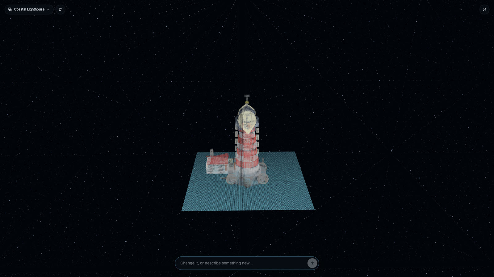
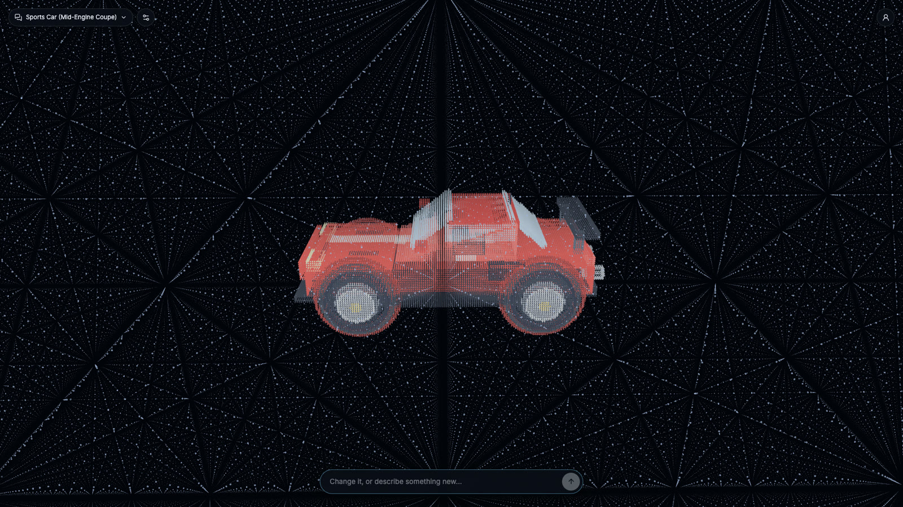
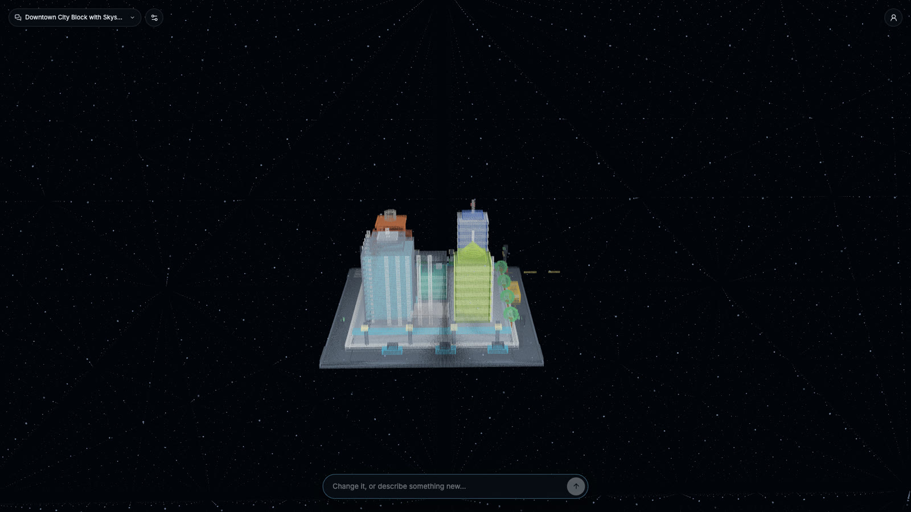
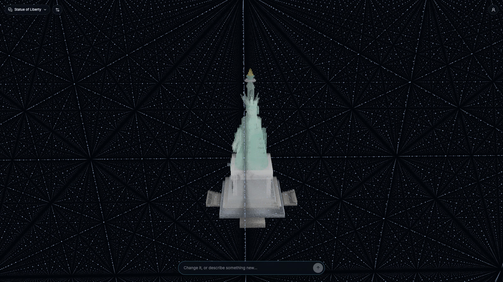
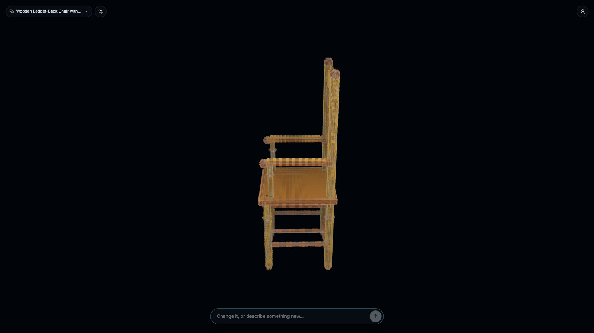

# Vertex 3D Studio

Describe an object in plain language and watch it appear in space, built from dots.

Claude designs the object as an assembly of parametric primitives — boxes, cylinders, cones,
spheres, wedges, rings — and the app expands that recipe into geometry and lights up the lattice
dots that lie on its surfaces. Every model stays editable: ask for a change and the recipe is
rewritten, not regenerated from scratch.

```
prompt ─► Claude ─► parts recipe (JSON) ─► surfaces ─► dots / mesh / wireframe ─► GLB · STL · OBJ
```

**[Open the gallery →](https://rajkandula.github.io/vertex-3d-studio/)** — finished models you can orbit,
re-draw and export in the browser. No key, no sign-in, nothing to install.



## Examples

Every model below came from a single prompt, unedited, with the part counts Claude actually used.

| `a sports car` — 37 parts | `a downtown city block` — 69 parts |
| --- | --- |
|  |  |
| **`the Statue of Liberty`** — 60 parts | **Mesh + wireframe over the dots** |
|  |  |

Then keep editing in plain language — `add armrests` reworked the chair and left the rest alone
(30 parts, 6,491 tokens, 19s):


## Features

- **Prompt to 3D** — "a lighthouse" becomes ~55 parts in about a minute (Claude Opus 5).
- **Keep editing** — "add armrests", "make it taller"; simple size and rotation tweaks apply
  instantly with no AI call.
- **Chats** — each conversation keeps its model, prompts and replies; reopen one and carry on.
- **See the cost** — tokens and time per build, plus Claude's summarized reasoning.
- **Detail levels** — Normal / High / Ultra raise the part budget, curve smoothness and dot density.
- **Views** — dots, solid mesh, wireframe, a background lattice of ~4.2M dots, auto-rotate.
- **Export** — GLB (with colours), STL (3D printing), OBJ, or the editable JSON recipe.
- **Accounts** — optional sign-in with saved models, backed by Harakumo (auth, SQLite, storage, mail).

## Running it

Requires Node.js 20+ and an [Anthropic API key](https://console.anthropic.com/).

```bash
npm install
cp .env.example .env     # then fill in ANTHROPIC_API_KEY
npm run dev              # http://localhost:3000
```

`ANTHROPIC_API_KEY` is all you need to build models. The `HARAKUMO_*` variables are only for
accounts and saved models; without them the app runs fine and everything stays in the browser.

| Script | What it does |
| --- | --- |
| `npm run dev` | Express + Vite dev server (`server.ts`) |
| `npm run build` | Bundles the client and the server into `dist/` |
| `npm start` | Runs the production build |
| `npm run lint` | TypeScript type-check |

## How it is put together

| Path | Role |
| --- | --- |
| `server.ts` | API: generation, accounts, saved models; serves the client |
| `server/harakumo.ts` | Harakumo client (auth, database, storage, mail) |
| `src/features/studio/engine/primitives.ts` | Expands a parts recipe into points, edges and faces |
| `src/features/studio/dots.ts` | Samples surfaces into lattice dots; builds the background field |
| `src/features/studio/DotSpace.tsx` | The three.js scene: dots, mesh, wireframe, framing |
| `src/features/studio/exporters.ts` | GLB / STL / OBJ / JSON export |
| `src/features/studio/state/studioStore.tsx` | Chats, models, view settings, undo |

The generation rules Claude follows (shape vocabulary, symmetry, three-pass detail) live in the
`PARTS_SYSTEM` prompt in `server.ts`; the reply is constrained to a JSON schema, so it is always a
valid parts program.

## Known limits

- **No real-world units.** Models are built in an arbitrary ±250 box, so a chair and a skyscraper
  come out the same size.
- **Shapes only add, never subtract** — no holes, hollows or interiors yet.
- **Claude never sees the result**, so it cannot notice a floating or misplaced part.
- **Organic subjects** (people, statues, animals) look blocky: simple solids can't do drapery or faces.
- Chats are stored in the browser, not in your account.

## Licence

[Apache-2.0](LICENSE).
